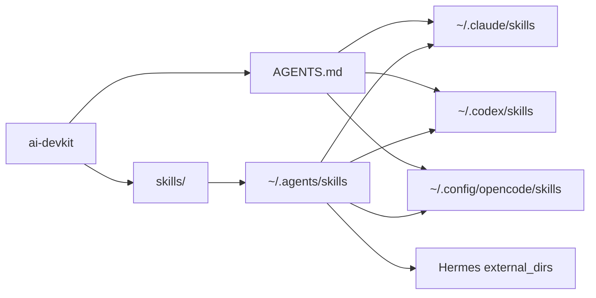

# AI Devkit

Единый devkit для локальных AI-агентов на macOS: **Claude Code**, **OpenAI Codex**, **OpenCode**, **Hermes**, общий слой skills, MCP-серверы и локальные модели через Ollama.

Цель репозитория простая: одна проверяемая конфигурация, которую можно поставить на новую машину и получить одинаковое поведение агентов без ручного копирования правил, skills и OpenCode-настроек.

Проверено локально: **10 июля 2026** на Apple Silicon.

---

## Что входит

| Слой | Состояние | Назначение |
|------|-----------|------------|
| `AGENTS.md` | включен | Единые правила поведения для Claude Code, Codex и OpenCode |
| `skills/` | 17 локальных skills | Проверенные рабочие навыки для code review, testing, Amori ops, MCP, git, debugging |
| OpenCode plugins | включены | `@dietrichgebert/ponytail`, `opencode-skills-collection@latest` |
| OpenCode SkillPointer | включен | 1595+ bundled skills через pointer/vault, без загрузки всего набора в контекст |
| OpenCode safety filter | включен | Блокирует `offensive` skill-категории; sensitive actions остаются под permission-gate |
| MCP | включен | Amori, memory, sequential-thinking, optional fetch |
| Ollama provider | включен | `qwen3.5:9b-mlx`, `gemma4:12b-mlx` для OpenCode |
| Bootstrap | включен | Симлинки, конфиги, skills sync, Claude MCP и локальные модели |

---

## Архитектура

```text
ai-devkit/
├── AGENTS.md
├── skills/
│   ├── agent-tooling-audit/
│   ├── amori-ops/
│   ├── code-review/
│   ├── debugging/
│   ├── git-safe/
│   └── ...
├── claude-code/
│   └── settings.json
├── codex/
│   └── config.example.toml
├── opencode/
│   ├── opencode.json
│   └── skill-filter.jsonc
├── models/
│   └── README.md
└── scripts/
    ├── bootstrap.sh
    └── sync-skills.sh
```



---

## Быстрый старт

```bash
git clone https://github.com/Lenis45/ai-devkit.git ~/ai-devkit
cd ~/ai-devkit
./scripts/bootstrap.sh
```

Bootstrap делает:

- симлинкует `AGENTS.md` в Claude Code, Codex и OpenCode;
- ставит `opencode/opencode.json` и `opencode/skill-filter.jsonc`;
- синхронизирует `skills/` в `~/.agents/skills`, `~/.codex/skills`, `~/.claude/skills`, `~/.config/opencode/skills`;
- регистрирует базовые MCP-серверы в Claude Code;
- подтягивает локальные Ollama-модели, если установлен `ollama`.

Повторный запуск безопасен: скрипты идемпотентны и не копируют секреты.

---

## Shared Skills

Репозиторий хранит доверенный локальный слой skills:

| Skill | Для чего |
|-------|----------|
| `agent-tooling-audit` | Аудит Codex, Claude Code, Hermes, OpenCode, MCP и drift |
| `amori-ops` | Проверка состояния Amori AI-infra, dashboard, очередей, агентов |
| `amori-project` | Делегирование задач Amori AI-team |
| `amori-content` | Контент-завод Amori с human approval |
| `business-process-automation` | Процессная аналитика, automation maps, HITL, audit |
| `code-review` | Senior code review с фокусом на риски |
| `commit-pr` | Чистые commit/PR workflow |
| `debugging` | Root-cause диагностика багов |
| `git-safe` | Безопасная работа с git |
| `mcp-tools` | Выбор и использование локальных MCP |
| `perf` | Measure-first performance workflow |
| `refactor` | Поведенчески безопасный refactor |
| `screenshot-product-qa` | UI QA через screenshots и визуальную проверку |
| `testing` | Осмысленное покрытие и regression checks |
| `web-research` | Актуальное web research с проверкой источников |

Ручная синхронизация:

```bash
./scripts/sync-skills.sh
```

---

## OpenCode

Канонический конфиг: [`opencode/opencode.json`](opencode/opencode.json).

Включено:

- `@dietrichgebert/ponytail` для сдержанного senior-режима;
- `opencode-skills-collection@latest` для большого каталога community skills;
- SkillPointer-подход: активные skills в `~/.config/opencode/skills`, полный каталог в `~/.config/opencode/skill-libraries`;
- safety filter: [`opencode/skill-filter.jsonc`](opencode/skill-filter.jsonc), блокирует offensive skills без поломки SkillPointer;
- MCP: Amori, memory, sequential-thinking, fetch disabled by default;
- локальный `ollama` provider с `qwen3.5:9b-mlx` и `gemma4:12b-mlx`.

Проверка:

```bash
opencode --version
opencode mcp list
opencode debug config
```

---

## Локальные модели

Подробно: [`models/README.md`](models/README.md).

| Модель | Назначение | Ограничение |
|--------|------------|-------------|
| `qwen3.5:9b-mlx` | код, tools, быстрые задачи | Лучше запускать отдельно от второй модели на 16 ГБ RAM |
| `gemma4:12b-mlx` | чат, reasoning, черновики | Может создавать swap при параллельной загрузке |

Прямой `ollama run` не получает MCP и skills. Локальные модели получают инструменты через OpenCode, когда выбран provider `ollama`.

---

## Проверки после установки

```bash
codex --version
claude --version
hermes --version
opencode --version

codex mcp list
claude mcp list
hermes mcp list
opencode mcp list

./scripts/sync-skills.sh
```

Если на машине есть Amori infra, дополнительно:

```bash
/Users/denis/ai-infra/scripts/agent_tooling_doctor.sh
```

---

## Безопасность

В репозитории не должно быть:

- API keys, provider tokens, Telegram bot tokens;
- `.env`, `.local`, session cookies;
- приватных channel IDs, customer data, личных сообщений;
- `~/.claude.json`, `auth.json`, OAuth tokens.

Публикуются только переносимые правила, scripts, safe configs и skills без секретов.

---

## Когда обновлять

Обновляй этот репозиторий, когда:

- добавлен новый локальный skill;
- изменились правила в `AGENTS.md`;
- поменялась схема MCP/OpenCode/Hermes;
- появилась новая стабильная локальная модель;
- doctor нашел drift между Codex, Claude, Hermes и OpenCode.

Минимальный release-check:

```bash
git diff --check
git status -sb
./scripts/sync-skills.sh
```

Перед push дополнительно запускай любой локальный secret scanner, если менялись configs,
skills или bootstrap-скрипты.
