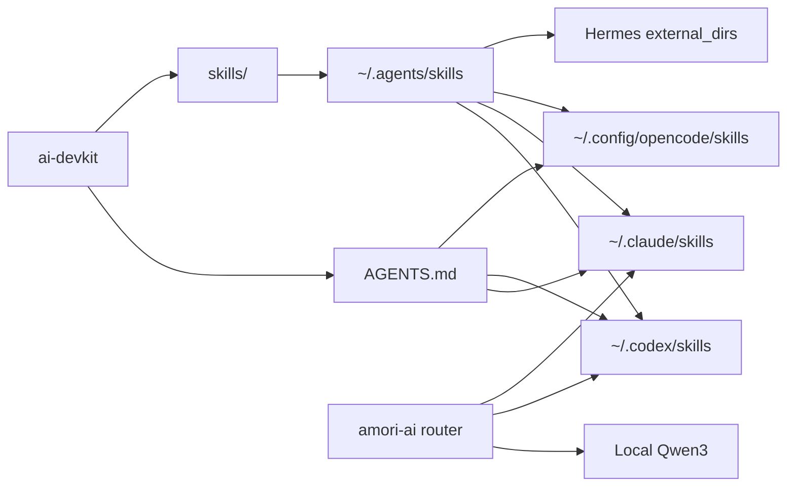

# AI Devkit

Единый devkit для локальных AI-агентов на macOS: **Claude Code**, **OpenAI Codex**, **OpenCode**, **Hermes**, общий слой skills, MCP-серверы и локальные модели через Ollama.

Цель репозитория простая: одна проверяемая конфигурация, которую можно поставить на новую машину и получить одинаковое поведение агентов без ручного копирования правил, skills и OpenCode-настроек.

Проверено локально: **20 августа 2026** на Mac mini M4 и MacBook Apple Silicon.

---

## Что входит

| Слой | Состояние | Назначение |
|------|-----------|------------|
| `AGENTS.md` | включен | Единые правила поведения для Claude Code, Codex и OpenCode |
| `skills/` | 18 локальных skills | Проверенные навыки, включая cost-aware routing и компактные handoff-пакеты |
| OpenCode plugins | включены | `@dietrichgebert/ponytail`, `opencode-skills-collection@latest` |
| OpenCode SkillPointer | включен | 1595+ bundled skills через pointer/vault, без загрузки всего набора в контекст |
| OpenCode safety filter | включен | Блокирует `offensive` skill-категории; sensitive actions остаются под permission-gate |
| MCP | включен | Amori, memory, sequential-thinking, optional fetch |
| Smart router | включен | `amori-ai`: local → Codex/Claude через подписочные CLI |
| Ollama provider | включен | `qwen3:1.7b`, `qwen3-vl:2b`, `qwen3:4b`, `amori-hermes:4b` |
| Bootstrap | включен | Симлинки, configs, skills, router, Claude MCP и локальные модели |

---

## Архитектура

```text
ai-devkit/
├── AGENTS.md
├── skills/
│   ├── agent-tooling-audit/
│   ├── amori-ops/
│   ├── code-review/
│   ├── debugging/
│   ├── git-safe/
│   └── ...
├── claude-code/
│   └── settings.json
├── codex/
│   └── config.example.toml
├── opencode/
│   ├── opencode.json
│   └── skill-filter.jsonc
├── models/
│   ├── Modelfile.hermes
│   └── README.md
├── router/
│   ├── amori_ai.py
│   ├── config.example.json
│   └── tests/
├── docs/
│   └── SMART_ROUTER.md
└── scripts/
    ├── amori-ai
    ├── bootstrap.sh
    ├── bootstrap-macbook.sh
    ├── configure-macbook.py
    ├── configure-hermes-local.py
    ├── install-router.sh
    └── sync-skills.sh
```



---

## Быстрый старт

```bash
git clone https://github.com/Lenis45/ai-devkit.git ~/ai-devkit
cd ~/ai-devkit
./scripts/bootstrap.sh
```

Bootstrap делает:

- симлинкует `AGENTS.md` в Claude Code, Codex и OpenCode;
- ставит `opencode/opencode.json` и `opencode/skill-filter.jsonc`;
- синхронизирует `skills/` в `~/.agents/skills`, `~/.codex/skills`, `~/.claude/skills`, `~/.config/opencode/skills`;
- устанавливает команду `amori-ai` и безопасный user config;
- регистрирует базовые MCP-серверы в Claude Code;
- подтягивает локальные Ollama-модели, если установлен `ollama`.

Повторный запуск безопасен: скрипты идемпотентны и не копируют секреты.

Для MacBook с локальной Ollama, Codex/Claude подписками и VPN используется профиль:

```bash
./scripts/bootstrap-macbook.sh
```

Он ставит лёгкую `qwen3:1.7b` для первичной маршрутизации, выбирает сильную уже установленную локальную модель для ответов, настраивает Hermes и OpenCode, синхронизирует skills и подключает MacBook worker к Mac Mini через закрытый SSH-туннель. Отдельный loopback-only HTTP proxy сохраняет работу подписочных CLI при включённом VPN, а Amori MCP доступен на MacBook через SSH stdio. Broker token переносится отдельно и никогда не хранится в репозитории.

---

## Shared Skills

Репозиторий хранит доверенный локальный слой skills:

| Skill | Для чего |
|-------|----------|
| `agent-tooling-audit` | Аудит Codex, Claude Code, Hermes, OpenCode, MCP и drift |
| `smart-model-routing` | Выбор local/Codex/Claude и компактный handoff без лишнего контекста |
| `amori-ops` | Проверка состояния Amori AI-infra, dashboard, очередей, агентов |
| `amori-project` | Делегирование задач Amori AI-team |
| `amori-content` | Контент-завод Amori с human approval |
| `business-process-automation` | Процессная аналитика, automation maps, HITL, audit |
| `code-review` | Senior code review с фокусом на риски |
| `commit-pr` | Чистые commit/PR workflow |
| `debugging` | Root-cause диагностика багов |
| `git-safe` | Безопасная работа с git |
| `mcp-tools` | Выбор и использование локальных MCP |
| `perf` | Measure-first performance workflow |
| `refactor` | Поведенчески безопасный refactor |
| `screenshot-product-qa` | UI QA через screenshots и визуальную проверку |
| `testing` | Осмысленное покрытие и regression checks |
| `web-research` | Актуальное web research с проверкой источников |

Ручная синхронизация:

```bash
./scripts/sync-skills.sh
```

---

## OpenCode

Канонический конфиг: [`opencode/opencode.json`](opencode/opencode.json).

Включено:

- `@dietrichgebert/ponytail` для сдержанного senior-режима;
- `opencode-skills-collection@latest` для большого каталога community skills;
- SkillPointer-подход: активные skills в `~/.config/opencode/skills`, полный каталог в `~/.config/opencode/skill-libraries`;
- safety filter: [`opencode/skill-filter.jsonc`](opencode/skill-filter.jsonc), блокирует offensive skills без поломки SkillPointer;
- MCP: Amori, memory, sequential-thinking, fetch disabled by default;
- always-on Mac provider с `qwen3:1.7b`, `qwen3-vl:2b`, `qwen3:4b`, `amori-hermes:4b`;
- optional Windows GPU provider через Tailscale.

Проверка:

```bash
opencode --version
opencode mcp list
opencode debug config
```

---

## Smart Router

Одна команда сначала бесплатно классифицирует запрос локальной `qwen3:1.7b`, затем:

- отвечает локально на простые вопросы;
- вызывает Codex CLI через ChatGPT OAuth для кода, файлов и тестов;
- вызывает Claude Code через Claude.ai OAuth для архитектуры и глубокого review.

```bash
amori-ai --route-only "Сравни архитектурные подходы"
amori-ai --explain "Исправь API и добавь тесты"
amori-ai --to codex --act --cwd ~/project "Исправь баг"
amori-ai --doctor
```

По умолчанию backend не меняет файлы. Изменения разрешаются только через `--act`. Полная схема, failure modes и cost policy: [`docs/SMART_ROUTER.md`](docs/SMART_ROUTER.md).

## Локальные модели

Подробно: [`models/README.md`](models/README.md).

| Модель | Назначение | Ограничение |
|--------|------------|-------------|
| `qwen3:1.7b` | быстрая классификация запросов | Не используется для пользовательских ответов и изменения репозиториев |
| `qwen3-vl:2b` | локальное распознавание фото/скриншотов | Не предназначен для сложного reasoning |
| `qwen3:4b` | локальные ответы без расхода подписок | Медленнее классификатора, но заметно надёжнее следует русским инструкциям |
| `amori-hermes:4b` | Hermes, 64K context | Использует те же веса, отдельной копии модели нет |

Прямой `ollama run` не получает MCP и skills. Локальные модели получают инструменты через OpenCode, когда выбран provider `ollama`.

---

## Проверки после установки

```bash
codex --version
claude --version
hermes --version
opencode --version
amori-ai --doctor

codex mcp list
claude mcp list
hermes mcp list
opencode mcp list

./scripts/sync-skills.sh
```

Если на машине есть Amori infra, дополнительно:

```bash
/Users/denis/ai-infra/scripts/agent_tooling_doctor.sh
```

---

## Безопасность

В репозитории не должно быть:

- API keys, provider tokens, Telegram bot tokens;
- `.env`, `.local`, session cookies;
- приватных channel IDs, customer data, личных сообщений;
- `~/.claude.json`, `auth.json`, OAuth tokens.

`amori-ai` не извлекает OAuth credentials и не проксирует подписки как API. Платные Hermes fallback отключены; live-проверка подписок запускается только явно через `amori-ai --doctor --live-check`.

Публикуются только переносимые правила, scripts, safe configs и skills без секретов.

---

## Когда обновлять

Обновляй этот репозиторий, когда:

- добавлен новый локальный skill;
- изменились правила в `AGENTS.md`;
- поменялась схема MCP/OpenCode/Hermes;
- появилась новая стабильная локальная модель;
- doctor нашел drift между Codex, Claude, Hermes и OpenCode.

Минимальный release-check:

```bash
git diff --check
git status -sb
./scripts/sync-skills.sh
```

Перед push дополнительно запускай любой локальный secret scanner, если менялись configs,
skills или bootstrap-скрипты.
