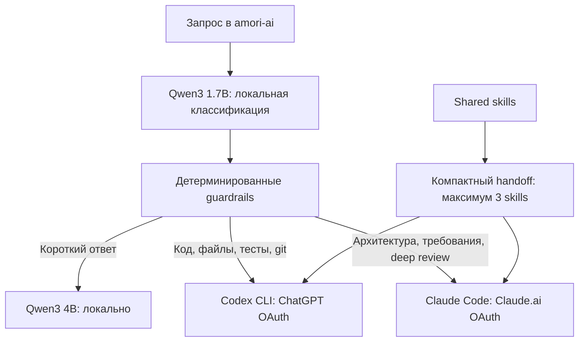

# Smart Model Router

`amori-ai` — единая terminal/chat точка входа, которая сначала бесплатно определяет сложность запроса, затем выбирает локальную модель, Codex или Claude Code.

## Зачем это нужно

Одинаковый запрос не должен автоматически получать самый дорогой и медленный исполнитель. Короткое объяснение не требует coding agent, а изменение репозитория нельзя доверять маленькой локальной модели.



## Что оплачивается

| Контур | Авторизация | Отдельная API-оплата |
|---|---|---|
| Локальная классификация и чат | Ollama на Mac | Нет |
| Codex | `codex login` через ChatGPT | Нет, используется лимит подписки |
| Claude Code | `claude auth login` через Claude.ai | Нет, используется лимит подписки |
| Hermes local | Ollama custom endpoint | Нет |

LiteLLM, OpenRouter и обычные API gateways намеренно не стоят между пользователем и подписочными CLI: они рассчитаны на API credentials и создали бы отдельный token bill. Маршрутизатор запускает официальные CLI как subprocess и не извлекает их OAuth-токены.

## Правила выбора

### Hermes/local

- короткие объяснения и бытовые вопросы;
- переписывание, суммаризация и черновики;
- запросы без файлов, команд и актуального web research.

### Codex

- чтение и изменение репозитория;
- реализация, debugging, тесты, сборка;
- browser/UI QA и git workflow;
- любые автоматически выбранные действия с кодом.

### Claude Code

- архитектура и сравнение подходов;
- требования, продуктовый и системный анализ;
- глубокий review и длинный planning context;
- реализация только когда пользователь явно указал `--to claude --act`.

Это рабочая специализация, а не утверждение, что одна модель всегда «умнее». Её нужно корректировать по собственному evaluation-набору и фактическим лимитам подписок.

## Безопасность действий

- По умолчанию включён режим `ask`: Codex получает read-only sandbox, Claude — plan permission mode, локальный контур только отвечает текстом.
- Изменения разрешаются только флагом `--act`.
- Автоматически выбранный action идёт в Codex с `workspace-write`, но не получает unrestricted host access.
- Явный `--to` уважается; `--to hermes --act` отклоняется.
- Текст запросов не пишется в metrics. Сохраняются только route, длительность, успех и названия skills.
- Платный fallback Hermes отключается, а auxiliary задачи закрепляются за `provider: main`.

## Установка

```bash
cd ~/github/ai-devkit
./scripts/install-router.sh
brew services start ollama
ollama pull qwen3:1.7b
ollama pull qwen3-vl:2b
ollama pull qwen3:4b
ollama create amori-hermes:4b -f models/Modelfile.hermes
```

Безопасное переключение Hermes сначала показывает dry run:

```bash
~/.hermes/hermes-agent/venv/bin/python scripts/configure-hermes-local.py
~/.hermes/hermes-agent/venv/bin/python scripts/configure-hermes-local.py --apply
```

Скрипт проверяет endpoint и модель до записи, создаёт timestamped backup, переносит ключи платных провайдеров из активного `.env` в приватную неактивную копию, отключает fallback и сокращает CLI toolsets.

## Использование

```bash
# Интерактивный чат
amori-ai

# Автовыбор и объяснение решения
amori-ai --explain "Исправь API и добавь тесты"

# Только классификация, без обращения к подпискам
amori-ai --route-only "Сравни два варианта архитектуры"

# Явный исполнитель
amori-ai --to hermes "Объясни RAG простыми словами"
amori-ai --to codex --cwd ~/project "Найди причину ошибки, ничего не меняй"
amori-ai --to claude --cwd ~/project "Проведи архитектурный review"

# Разрешить изменения
amori-ai --to codex --act --cwd ~/project "Исправь баг и прогони тесты"
```

В интерактивном режиме доступны `/route`, `/to auto|hermes|codex|claude`, `/act on|off`, `/new`, `/exit`.

## Skills и компактный handoff

Маршрутизатор индексирует frontmatter из `~/.agents/skills/*/SKILL.md`, выбирает максимум три навыка и передаёт только имя, описание и путь. Исполнитель сам читает полный `SKILL.md`, если он действительно нужен.

Handoff содержит цель, проверенные факты, ограничения, пути и acceptance checks. Полная история чата, неотносящиеся документы и весь каталог skills не дублируются, поэтому input context заметно меньше.

Интеграции с большим системным prompt могут передать отдельный `--routing-text`.
Тогда модель выбирается только по вопросу пользователя, а полный контекст получает
уже выбранный backend. Это не даёт словам из документации или памяти случайно
переключить простой вопрос на Codex либо Claude.

## Диагностика и метрики

```bash
amori-ai --doctor
amori-ai --doctor --live-check  # делает реальные вызовы и расходует allowance
amori-ai --stats
```

Обычный doctor не тратит allowance и поэтому показывает reported OAuth status. `--live-check` нужен после входа, обновления CLI или подозрения на revoked token.

Metrics лежат в `~/.local/state/amori-ai/usage.jsonl`. Текст запросов туда не попадает.

## Отказоустойчивость

| Сбой | Поведение |
|---|---|
| Ollama недоступна | Классификация переходит на локальные правила; простой ответ не уходит в платный API молча |
| Маленькая модель вернула плохой JSON | Alias нормализуется или включается rule fallback |
| Модель ошиблась в сильном сигнале | Guardrails исправляют code action → Codex, architecture → Claude |
| Claude OAuth отозван или исчерпан лимит | Автомаршрут сообщает о проблеме и завершает запрос через Codex; явный `--to claude` возвращает ошибку |
| Windows выключена | Используется Mac Ollama; Tailscale node не является обязательным |
| Hermes слишком медленный | Быстрый чат идёт напрямую в Ollama, сложная работа — в подписочный CLI |

## Проверка разработки

```bash
python3 -m unittest discover -s router/tests -v
python3 -m py_compile router/amori_ai.py scripts/configure-hermes-local.py
jq empty router/config.example.json opencode/opencode.json
git diff --check
```
